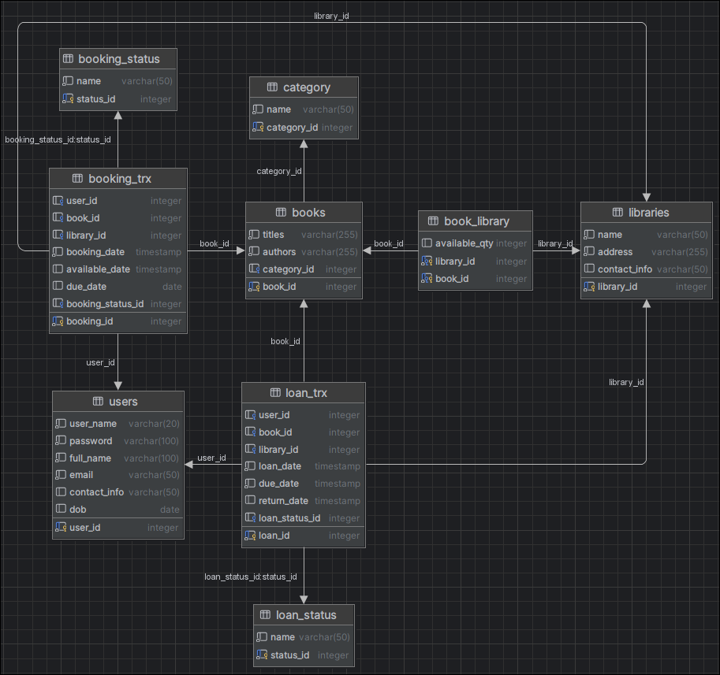

# E-Library-DB
Database System For An E-Library Application

# Database Specification:
* Project's Objectives
* Features
* Limitations
* ERD Diagram
* Populating the Database
* Retrieve Data
* Installation

# Project's Objectives:
The e-library application oversees multiple libraries, each housing a diverse collection of books with varying quantities available for borrowing. Users can register on the platform, interact with the system by borrowing books, placing holds, and managing their accounts. Books are categorized to facilitate searching, and users can borrow books from any library in the system if they are available.

# Features:
* Multiple Libraries Management: The application manages multiple libraries, each with its collection of books.
* Book Collection Management: Stores information about books including titles, authors, available quantities, and categories.
* User Registration: Users can register on the platform to borrow books, place holds, and manage their accounts.
* Loan System: Users can borrow books with a loan period of 2 weeks, and they can return books earlier than the due date. Automatic book returns occur when books exceed the due date.
* Hold System: Users can place holds on books that are currently unavailable. The system maintains a hold queue, and when a book becomes available, it can be borrowed by the customer at the front of the queue. Holds expire if not borrowed within one week.
* Limits: Users are restricted to borrowing a maximum of 2 books at a time, and they can only hold a maximum of 2 books simultaneously.

# Limitations
* Maximum Number of Books Borrowed: Users are limited to borrowing a maximum of 2 books at a time.
* Maximum Number of Holds: Users can only hold a maximum of 2 books simultaneously.
* Loan Period: The loan period for borrowed books is fixed at 2 weeks.
* Automatic Book Returns: Books are automatically returned when they exceed the due date.
* Hold Expiration: If a user doesn't borrow a held book within one week, the hold is released for other users to borrow.

# ERD Diagram:


# Populating the Database
Populating the database can be achieved by generating dummy data that reflects real-world scenarios. This script demonstrates how to create realistic data for users, libraries, books, loans, and bookings. The script utilizes the Faker library to generate random yet believable information. The data is then exported to individual CSV files, which are subsequently imported into the PostgreSQL database using the copy_expert method for efficiency. This approach allows for easy population of the database for testing and analysis purposes.

# Retrieve Data
To gain deeper insights into e-library user behavior and optimize operations, the following five key questions were formulated to analyze the database data.

1. **Which libraries have the most borrowed books?**  
   This question helps identify popular libraries and potential areas for increasing book quantities or staffing.
``` 
SELECT libraries.name, SUM(book_library.available_qty) AS total_borrowed
FROM book_library
        INNER JOIN libraries ON book_library.library_id = libraries.library_id
GROUP BY libraries.library_id
ORDER BY total_borrowed DESC; 
```

2. **How many books are currently on loan and not returned past the due date?**  
This question is important to answer as it helps to identify the overdue books in the library system. It provides insights into potential issues with book return policies, user behavior, or communication regarding due dates. By understanding the number of books currently on loan and past their due dates, library administrators can take proactive measures to follow up with borrowers, send reminders, and enforce return policies if necessary.
```
SELECT COUNT(*) AS overdue_books
FROM loan_trx
WHERE return_date IS NULL AND due_date < CURRENT_DATE;
```

3. **Which category of books is most popular among borrowers?**  
   This question is important to answer as it helps to identify the most popular category of books among borrowers is crucial for several reasons. It helps libraries tailor their collection development strategies, allocate resources effectively, and organize events or promotions to meet user preferences. By identifying the most popular category, libraries can ensure that they have a diverse and appealing selection of books that cater to the interests and needs of their users.
```
SELECT c.name AS category_name, COUNT(lt.loan_id) AS total_loans
FROM loan_trx lt
        JOIN books b ON lt.book_id = b.book_id
        JOIN category c ON b.category_id = c.category_id
GROUP BY c.name
ORDER BY total_loans DESC
LIMIT 1;
```

4. **What is the average loan period for books?**  
This question is important to answer as it helps to identify the average loan period for books is essential for assessing the effectiveness of the current loan policies and user behavior. It provides insights into how long borrowers typically keep books before returning them and helps libraries evaluate whether the loan period aligns with user needs and expectations.
```
SELECT AVG(EXTRACT(EPOCH FROM (return_date - loan_date))) / 86400 AS avg_loan_period_days
FROM loan_trx
WHERE return_date IS NOT NULL;
```

5. **How many users have placed holds on books that are currently unavailable??**  
   This question is important to answer as it helps to Identify the number of users who have placed holds on books that are currently unavailable is important for assessing the demand for popular titles and managing the hold queue effectively.
```
SELECT COUNT(DISTINCT user_id) AS users_with_unavailable_holds
FROM booking_trx
WHERE available_date IS NULL;
```

# Installation
1. List any prerequisites or dependencies required to run the project. For example, PostgreSQL must be installed and running on the local machine.
2. Clone the repository
3. Install Python dependencies in the DATABASE folder 
   ```
   pip3 install -r requirements.txt
   ```
4. Execute data_dummy.py in the DATABASE folder, ensuring to modify the database variable
   - Modify the connection variable in the conn_string variable:
   ```
   conn_string = "dbname='elibrary' user='dev' host='localhost' password='adminroot'"
   ```

   - Run python script
   ```
   python3 data_dummy.py
   ```
